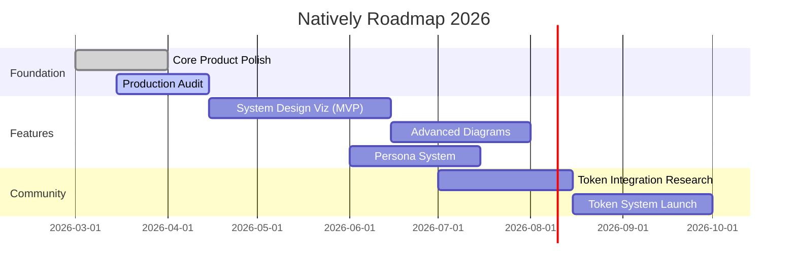
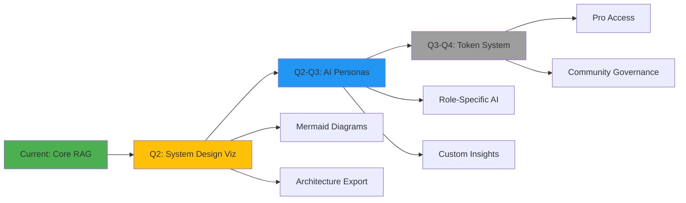
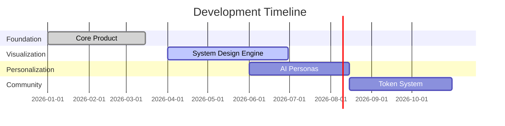

# Visual Roadmap Options for GitHub README

## Option 1: Progress Bars with Emojis (Clean & Modern)

```markdown
## 🗺️ Roadmap

### 🎨 System Design Visualization
> Transform meetings into architecture diagrams automatically

 **Planning Phase**

**Features:**
- ✅ Research & design
- 🔄 Mermaid integration
- ⏳ DFA/NFA generators
- ⏳ Export functionality

---

### 👤 AI Personas
> Context-aware AI that understands your role

 **Research Phase**

**Planned Personas:**
- 💻 Software Engineer
- 👔 HR Professional  
- 📊 Product Manager
- 💼 Sales Representative
- 🎨 Designer

---

### 🪙 Natively Token & Pro
> Community rewards through token holding

 **Backlog**

**Benefits:**
- 🎁 1 month free Pro
- 🔓 Continuous access while holding
- ⚡ Early feature access
```

**Preview:**
- Uses `https://geps.dev/progress/{percentage}` for dynamic progress bars
- Color-coded emojis make it scannable
- Shows status at a glance

---

## Option 2: Timeline with Mermaid (Interactive & Professional)

```markdown
## 🗺️ Development Timeline


\```

**Renders as:** An interactive Gantt chart directly in GitHub

---

## Option 3: Roadmap Cards with Shields.io (Badges Galore)

```markdown
## 🗺️ Feature Roadmap

<table>
<tr>
<td width="33%" valign="top">

### 🎨 System Design Visualization


**Q2 2026**

Generate visual diagrams from meetings:
- Architecture diagrams
- DFA/NFA state machines
- Sequence diagrams
- Flowcharts

**Tech Stack:**
- Mermaid.js
- D3.js
- Custom renderers

</td>
<td width="33%" valign="top">

### 👤 AI Personas


**Q2-Q3 2026**

Role-specific AI assistants:
- 💻 Engineer
- 📊 Product Manager
- 👔 HR Professional
- 🎨 Designer
- 💼 Sales

**Features:**
- Custom prompts
- Domain insights
- Tailored questions

</td>
<td width="33%" valign="top">

### 🪙 Token & Pro Access


**Q3-Q4 2026**

Community rewards:
- Free Pro for holders
- Early access
- Governance rights

**Requirements:**
- Wallet integration
- Token verification
- Subscription sync

</td>
</tr>
</table>
```

---

## Option 4: Interactive Checklist (GitHub Native)

```markdown
## 🗺️ Roadmap

### Phase 1: Foundation (Q2 2026)
- [x] Multi-provider embedding system
- [x] RAG pipeline implementation
- [ ] Production security audit
- [ ] Performance optimization
- [ ] Error handling improvements

### Phase 2: Differentiation (Q2-Q3 2026)
- [ ] **System Design Visualization** 🎨
  - [ ] Mermaid integration
  - [ ] Flowchart generation
  - [ ] DFA/NFA state diagrams
  - [ ] Sequence diagram support
  - [ ] Export to SVG/PNG
  - [ ] Custom styling options

### Phase 3: Personalization (Q3 2026)
- [ ] **AI Personas** 👤
  - [ ] Software Engineer persona
  - [ ] Product Manager persona
  - [ ] HR Professional persona
  - [ ] Designer persona
  - [ ] Sales Representative persona
  - [ ] Persona switching UI
  - [ ] Custom question suggestions

### Phase 4: Community (Q3-Q4 2026)
- [ ] **Token System** 🪙
  - [ ] Blockchain research
  - [ ] Wallet integration
  - [ ] Token verification
  - [ ] Pro feature gating
  - [ ] Community governance
```

**Best for:** Showing granular progress, gets auto-checked in GitHub

---

## Option 5: Visual Flow Diagram with Mermaid

```markdown
## 🗺️ Product Evolution


\```

**Renders as:** A flowchart showing feature dependencies

---

## Option 6: Emoji Timeline (Simple & Effective)

```markdown
## 🗺️ Timeline

```
📍 You are here
│
├─ ✅ Q1 2026: Core Product
│   ├─ Multi-provider embeddings
│   ├─ RAG search
│   └─ Local-first architecture
│
├─ 🔄 Q2 2026: Visualization Engine
│   ├─ System design diagrams
│   ├─ Mermaid integration
│   └─ DFA/NFA generators
│
├─ ⏳ Q3 2026: Personalization
│   ├─ AI personas (5 roles)
│   ├─ Custom prompts
│   └─ Domain insights
│
└─ 💡 Q4 2026: Community
    ├─ Token integration
    ├─ Pro access system
    └─ Governance features
```
\```

---

## 🎯 My Recommendation: **Hybrid Approach**

Combine the best of multiple styles:

```markdown
## 🗺️ Roadmap

<p align="center">
  
  <br>
  <sub>40% Complete - Q2 2026</sub>
</p>

---

### 🎨 System Design Visualization
**Status:**  

> Transform technical discussions into professional diagrams automatically

**What we're building:**
- 📊 Architecture diagrams from system design discussions
- 🔄 DFA/NFA state machines from workflow conversations  
- ⚡ Sequence diagrams from API discussions
- 🎯 Flowcharts from process planning

**Timeline:** Q2 2026 (Apr-Jun)

<details>
<summary><b>📋 Detailed Checklist</b></summary>

- [ ] Mermaid.js integration
- [ ] Specialized prompting system
- [ ] Diagram type detection
- [ ] In-app rendering
- [ ] Export to SVG/PNG
- [ ] Diagram editing UI

</details>

---

### 👤 AI Personas
**Status:**  

> Select an AI personality that understands your professional context

**Planned Personas:**

| Persona | Focus Area | Key Features |
|---------|-----------|--------------|
| 💻 Software Engineer | Technical decisions | Architecture, APIs, code implications |
| 📊 Product Manager | Features & roadmap | User needs, priorities, timelines |
| 👔 HR Professional | People & culture | Team dynamics, policies, onboarding |
| 🎨 Designer | UX/UI | User journeys, design systems, accessibility |
| 💼 Sales | Deals & relationships | Opportunities, objections, next steps |

**Timeline:** Q2-Q3 2026 (Jun-Aug)

---

### 🪙 Natively Token & Pro Access
**Status:**  

> Community rewards through token holding

**How it works:**
1. Acquire Natively token
2. Get 1 month free Pro access
3. Keep Pro as long as you hold the token

**Pro Features:**
- ✨ All visualization features
- 🎭 Full persona library
- 🚀 Priority processing
- 📤 Export capabilities
- 🔌 API access

**Timeline:** Q3-Q4 2026 (Aug-Oct)

---

## 📊 Progress Overview



---

## 💬 Have Input?

We're building in public! Have ideas or want to contribute?

[](https://github.com/yourusername/natively/discussions)
[](https://github.com/yourusername/natively/issues/new?labels=feature-request)
```

---

## Why This Hybrid Works:

✅ **Progress bars** show overall status at a glance  
✅ **Badges** give quick visual status indicators  
✅ **Mermaid Gantt** shows timeline professionally  
✅ **Collapsible details** keep it clean but detailed  
✅ **Tables** organize persona comparison nicely  
✅ **Emojis** make it friendly and scannable  

This gives you:
- **Visual appeal** (not wall of text)
- **Interactivity** (expandable sections)
- **Professional look** (charts, badges)
- **Easy to update** (just change badge text/progress %)
